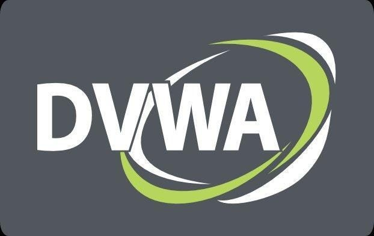
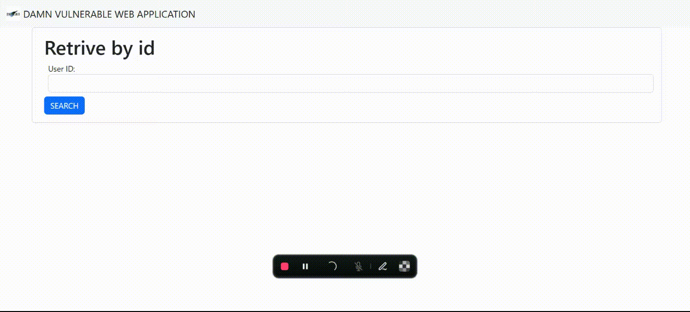

<center>
    
</center>

# DAMN Vulnerable web application for testing

Damn Vulnerable Web Application (DVWA) is a PHP/MySQL web application that is damn vulnerable. Its main goal is to be an aid for security professionals to test their skills and tools in a legal environment, help web developers better understand the processes of securing web applications and to aid both students & teachers to learn about web application security in a controlled class room environment.

The aim of DVWA is to practice some of the most common web vulnerabilities, with various levels of difficulty, with a simple straightforward interface. Please note, there are both documented and undocumented vulnerabilities with this software. This is intentional. You are encouraged to try and discover as many issues as possible.


## How to use
1. create a `.env` file reference from `.env.sample` and add values
    ```
    DB_NAME=vaccine
    DB_USERNAME=admin
    DB_PASSWORD=password
    ```
2. run web server
   ```sh
   make
   ```
3. Access web on port 8000 `http://localhost:8000`
4. Access adminer on port 8080 `http://localhost:8080`

## Demo



#### NOTE
```diff
+ for 42's Machine, You need run `make fclean` every time before restart to ensure data volume is created by docker user
```

## Site
Base root path to select database type testing
- /pgsql : `Postgresql` database testing
- /mysql : `MySQL` database Testing
- /sqlite : `SQLite` database Testing

Sub path for select method testing
- /<db_type>/ : method `GET` testing
- /<db_type>/login : method `POST` testing

## DB Driver
- [sqlite3]
- [mysqlclient]
- [psycopg2]

## Reference
- [DVWA]
- [injection-web-example-code]
- [sqli]

<!-- Link reference -->
[sqlite3]: https://docs.python.org/3/library/sqlite3.html
[mysqlclient]: https://pypi.org/project/mysqlclient/
[psycopg2]: https://pypi.org/project/psycopg2/

[DVWA]: https://github.com/digininja/DVWA
[injection-web-example-code]: https://gitlab.cylab.be/cylab/play/sql-injection/-/blob/main/public/index.php?ref_type=heads
[sqli]: https://github.com/digininja/DVWA/blob/master/vulnerabilities/sqli/source/high.php
